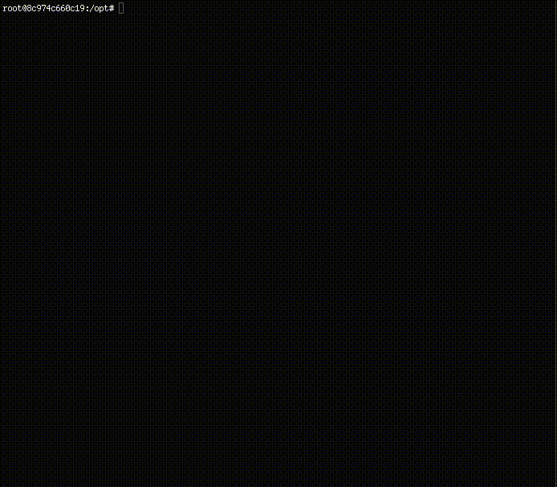

# UpStride Classification API

## What is this repository?

Hi there 👋

We are really excited today to open our Github to the world! After months of research and development we decided to start giving back to the community with our first open-source repository.

We are sharing a classification code that we use internally to benchmark our engine on several datasets.

This training script has also been shared to our clients to smooth the first time use of our product and  simplify the creation of state-of-the-art neural networks.

We hope it will bring value to you as well!

Here you will find how to convert your dataset to TFRecord format, load them with an efficient data pipeline with various data augmentation strategies and classic deep learning models.

We are also working on an integration of Keras-Tuner for metaparameter search and Differential architectures search method for auto-ml experiments.

We will explain here how to use it with and without Upstride API. 

If you're interested in trying this script powered by Upstride technology 🚀 feel free to reach out to us at hello@upstride.io

## How do I get set up?

Start off by cloning this repository; be careful it uses git submodules, please proceed by doing a`git clone --recurse-submodules`. 

If you forgot to do it, don't panic you can still do a `git submodule update --init`.

The easiest way is to use docker; we provide 2 docker files, one to run these code using Tensorflow 2.3, and the other one to run UpStride 1.0. 

You can build them by using `make build` or `make build_tensorflow`.

The tensorflow docker image will soon be on dockerhub. 

## How do I start a training ?

See the 🎓 [Documentation](documentation/doc.md)

or

Get started with [cat vs dog classification example](documentation/cat_dog.ipynb)

## Unittesting and code coverage
* To run the unittests, run `python test.py`
* To get the coverage, run `coverage run test.py`. Then `coverage report` show the coverage information and `coverage xml` create a file usable by VSCode

## Would you like to contribute?

If you discovered a bug or have any idea please raise an issue. If you wish to contribute, pull requests are also welcome. 

We will try to review them as fast as possible to integrate your work in a timely manner. 

Unit-tests with pull requests are also welcome to smooth this process.

Thank you!
✌️
